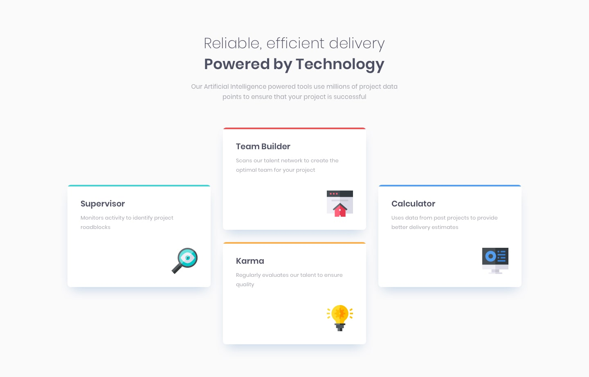

# Four Card Feature Section - Frontend Mentor Project

A responsive four-card feature section created as a solution to the [Frontend Mentor challenge](https://www.frontendmentor.io/challenges/four-card-feature-section-weK1eFYK). This project showcases a grid-based layout with dynamic positioning of feature cards.

## Overview

### The Challenge

Users should be able to:

- View an optimal layout of four feature cards based on their device's screen size
- See hover states for interactive elements
- Experience a fully responsive design

### Screenshot



### Links

- Live Site URL: [View Live Project](#)
- Solution URL: [Frontend Mentor Solution](#)

## My Process

### Built With

- Semantic HTML5 markup
- SCSS with custom variables
- CSS Grid layout
- Flexbox
- Mobile-first workflow
- BEM methodology for CSS

### Key Learnings

- Used grid-template-areas for complex grid layouts
- Implemented responsive design with SCSS mixins
- Created reusable components with SCSS partials
- Applied proper semantic HTML structure

### Code Examples

```scss
.main {
  display: grid;
  grid-template-columns: 1fr 1fr 1fr;
  grid-template-rows: 1fr 1fr;
  gap: 2rem;
  padding: 2rem;
}

.card {
  &:nth-child(1) {
    grid-column: 1;
    grid-row: 1 / span 2;
    align-self: center;
    justify-self: end;
  }
}
```

## Acknowledgments

Thanks to Frontend Mentor for providing this challenge and helping developers improve their coding skills through realistic projects.
